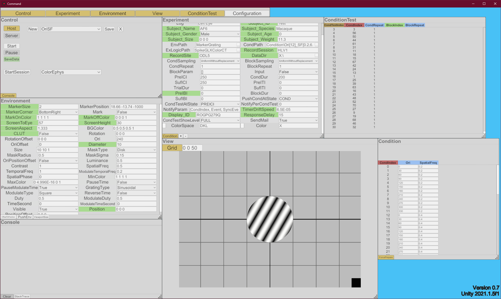
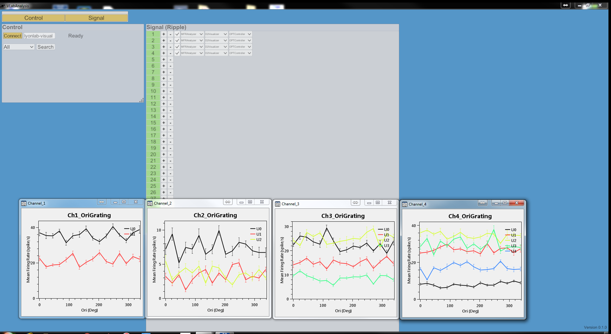

“Rome wasn't built in a day”, so is our understanding of the world. All heroic adventures in our history started by testing and experimenting in a confined and controlled environment. This is actually a virtual environment in a laboratory and Experica is a software system to help us managing the virtual environment.

Given a virtual environment, if we can intercept and insert any logic between interaction of subjects, then we can analyze the physical laws of the world and through which to control the world. Experica is designed on those conceptions and try to achieve several favorable traits.

1. Modulation

    Different parts of the system should be separated in software space focusing on their well-defined function, so that they can evolve separately and combined flexibly. Experica is distributed across IP network communicating through UDP/TCP.

2. Experiment component

    Different parts of an experiment should be further componentized, so people could design experiment on a higher, abstract level and reuse different components. Experica abstracts on experiment subject, the environment in which subject is tested, the conditions we designed to test, the protocol we want to employ, etc. 

3. Online analysis and control

    Immediate result is not only important for examine the process of experiment, but also need for immediate feedback control. Experica uses a multi-threaded, parallel analysis architecture suited to harness the power of many-core CPUs and GPUs, and in the meantime asynchronously communicating and controlling through network. 

Beside aforementioned design goal, Experica is also cross-platform and be able to work with many hardware systems. We hope Experica could help scientists and engineers, whether to explore the brain or to cure and even enhance the brain.

{:.border.rounded.shadow}

{:.border.rounded.shadow}

Powering Next Generation Research and Application

